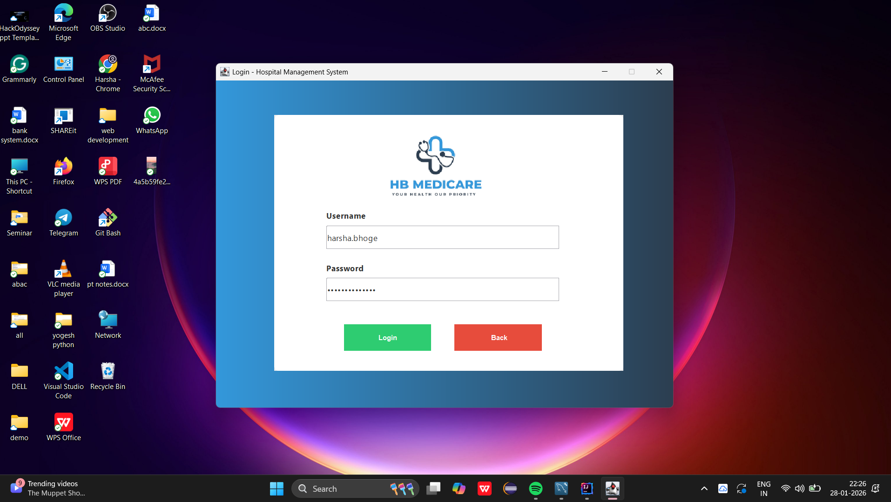
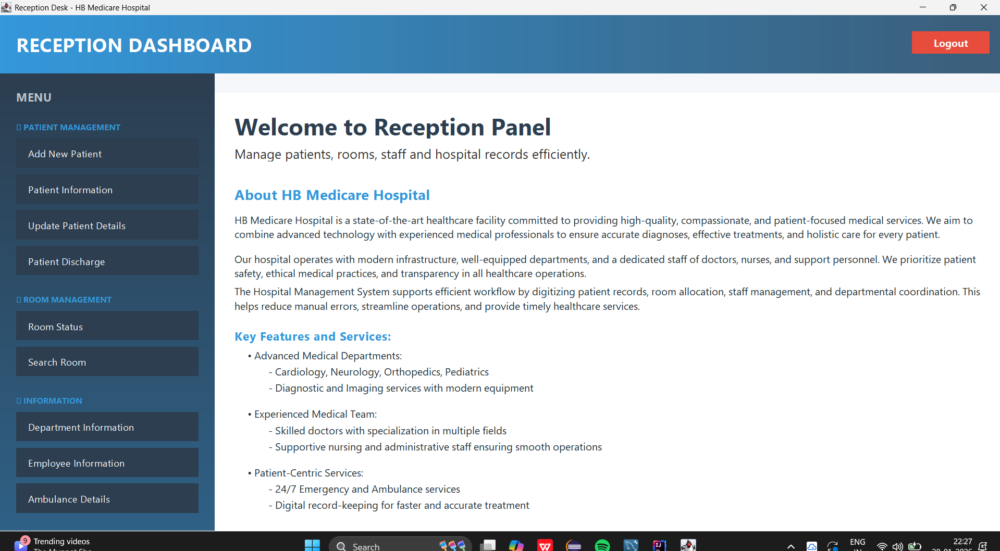
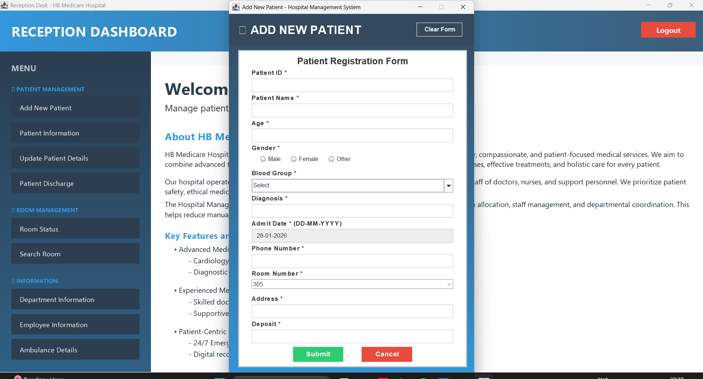
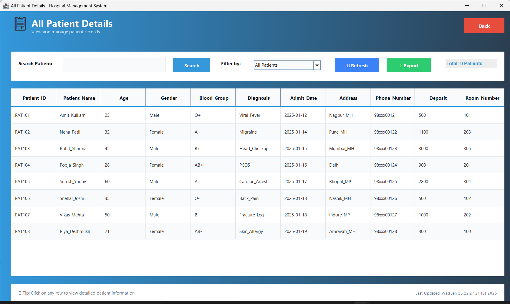
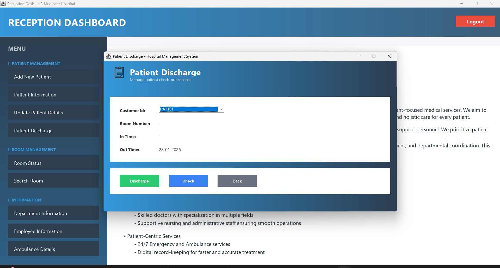

# Hospital Management System (Java Swing)

A desktop-based Hospital Management System developed using **Java Swing** and **MySQL** to efficiently manage hospital operations such as patient records, room allocation, employee information, departments, and ambulance services. The system provides a structured, user-friendly interface with reliable database integration.

---

## Overview

This project is designed to automate and simplify routine hospital management tasks. It follows a modular architecture where each module handles a specific responsibility, ensuring maintainability and scalability.

---

## Key Features

### Authentication & Navigation
- Secure login system
- Centralized reception dashboard for module access

### Patient Management
- Add new patient records
- View complete patient details with search and filter options
- Update patient information such as room number, deposit, and time
- Discharge patients with automatic room status update

### Room Management
- View room details
- Track availability (Available / Occupied)
- Search and filter room records

### Employee Management
- View employee details
- Search employees
- Filter by employment status

### Department Management
- View hospital departments and related information

### Ambulance Management
- View ambulance details

---

## User Interface

- Desktop application built using Java Swing
- Consistent layout and color scheme across all modules
- Table-based data visualization with sorting, searching, and filtering
- Simple and intuitive navigation

---

## Technologies Used

- Java (Core Java, Swing)
- MySQL
- JDBC (Java Database Connectivity)
- DbUtils
- AWT & Swing Components

---

## Database Design

The system uses the following MySQL tables:

- patient_info
- room
- emp_info
- department
- ambulance

Ensure that all tables are created and configured before running the application.

---

## How to Run the Application

1. Open the project in IntelliJ IDEA, Eclipse, or NetBeans  
2. Add the MySQL Connector (JAR file) to the project libraries  
3. Configure database credentials in `conn.java`  
4. Run `Login.java` to start the application  

---

## Screenshots

Important application screens are included for reference.

---
## Author

Harsha Bhoge  
B.Tech Student | Java Developer  

Hospital Management System – Java Swing
